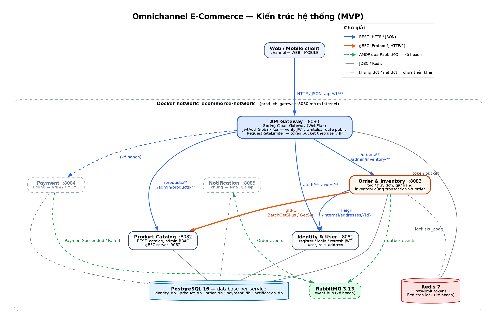

# Omnichannel E-Commerce

Hệ thống thương mại điện tử đa kênh (Web / Mobile) theo kiến trúc **microservices**, viết bằng Java 17 + Spring Boot 4. Mỗi bounded context là một service với database riêng; client chỉ đi qua API Gateway.

> **Hạn nộp: 15/10/2026** (đã lùi từ 08/10).



## Tài liệu

| Tài liệu | Nội dung |
| --- | --- |
| [docs/DDD_DB_API_Contract.md](docs/DDD_DB_API_Contract.md) | Bounded context, schema từng database, API contract v1, luồng checkout và giữ hàng |
| [docs/Scope_Adjustments.md](docs/Scope_Adjustments.md) | Đối chiếu với đề bài và lý do điều chỉnh phạm vi |
| [docs/architecture.png](docs/architecture.png) | Sơ đồ kiến trúc (nguồn: [docs/architecture.dot](docs/architecture.dot)) |
| [docs/erd/](docs/erd/) | ERD của từng database |

## Công nghệ

| Thành phần | Công nghệ |
| --- | --- |
| Ngôn ngữ / framework | Java 17, Spring Boot 4.1.1, Gradle 9.7.1 (multi-module) |
| API Gateway | Spring Cloud Gateway (WebFlux) 2025.1.3, rate limit bằng Redis |
| Giao tiếp đồng bộ | REST (JSON), OpenFeign, **gRPC** (Protobuf, grpc-java 1.68.1) |
| Giao tiếp bất đồng bộ | RabbitMQ 3.13 + Transactional Outbox *(đang triển khai)* |
| Database | PostgreSQL 16, Flyway migration — database per service |
| Cache / lock | Redis 7, Redisson *(lock đang triển khai)* |
| Bảo mật | JWT (HS512, jjwt 0.13), RBAC `USER` / `ADMIN` |
| Đóng gói | Docker multi-stage build, Docker Compose |

## Các service

| Service | Cổng | Database | Trạng thái |
| --- | --- | --- | --- |
| `api-gateway` | 8080 | — | ✅ Định tuyến, xác thực JWT, rate limit |
| `identity-service` | 8081 | `identity_db` | ✅ Đăng ký, đăng nhập, refresh token, địa chỉ |
| `product-service` | 8082 (REST), 9082 (gRPC) | `product_db` | ✅ Catalog, quản trị sản phẩm, gRPC `GetSku` / `BatchGetSkus` |
| `order-service` | 8083 | `order_db` | ✅ Tạo / hủy / xem đơn, giữ hàng, quản trị tồn kho |
| `payment-service` | 8084 | `payment_db` | 🚧 Khung |
| `notification-service` | 8085 | `notification_db` | 🚧 Khung |

Module dùng chung: `common` (envelope response, JWT verify) và `grpc-api` (file `.proto` + stub sinh tự động).

## Chạy toàn hệ thống bằng 1 lệnh

**Yêu cầu:** Docker Desktop (Compose v2; riêng file prod cần ≥ v2.24 vì dùng `!reset`/`!override`) và **còn trống ≥ 6 GB RAM**: 6 JVM × 512 MB cộng hạ tầng. Không cần cài JDK, vì code được build bên trong container.

```powershell
docker compose up -d --build --wait
```

Lệnh này build 6 image, khởi động 9 container và chỉ trả về khi tất cả đã `healthy`. Thứ tự khởi động được đảm bảo bằng `depends_on: condition: service_healthy`: hạ tầng → identity, product → order → gateway. Lần build đầu mất khoảng 5–10 phút để tải dependency của Gradle.

File `.env` **không bắt buộc**, vì mọi biến đều có giá trị mặc định. Muốn tùy chỉnh (mật khẩu, JWT secret, cổng) thì:

```powershell
Copy-Item .env.example .env
```

Kiểm tra nhanh sau khi chạy:

```powershell
docker compose ps
curl.exe -s http://localhost:8080/actuator/health                               # {"status":"UP",...}
curl.exe -s -o NUL -w "%{http_code}`n" http://localhost:8080/api/v1/products     # 200 (public)
curl.exe -i http://localhost:8080/api/v1/orders                                 # 401 JSON từ gateway
```

> Trong PowerShell 5.1, `curl` là alias của `Invoke-WebRequest`; hãy gõ `curl.exe`.

Các lệnh thường dùng:

```powershell
docker compose logs -f order-service     # xem log một service
docker compose up -d --build api-gateway # build lại một service sau khi sửa code
docker compose down                      # dừng, giữ dữ liệu
docker compose down -v                   # dừng và XÓA toàn bộ dữ liệu (volume)
```

### Triển khai trên server (prod)

```powershell
docker compose -f docker-compose.yml -f docker-compose.prod.yml up -d --build --wait
```

[docker-compose.prod.yml](docker-compose.prod.yml) chỉ ghi đè phần `ports`:

- `api-gateway` giữ `8080`, là **cổng duy nhất mở ra Internet**.
- 5 service ứng dụng không publish cổng nào. Chúng vẫn gọi nhau qua mạng Docker bằng tên service.
- PostgreSQL, Redis, RabbitMQ chỉ bind `127.0.0.1`, nên muốn truy cập phải SSH vào máy (ví dụ `ssh -L 5432:127.0.0.1:5432 user@vps`).

Lưu ý: `ufw` **không** chặn được cổng do Docker publish, vì Docker tự ghi luật iptables vượt qua ufw. Phải chặn ngay trong file compose như trên.

## Chạy từng service khi phát triển

Chạy hạ tầng bằng Docker, chạy service cần sửa bằng IDE hoặc Gradle. Cần JDK 17.

```powershell
Copy-Item .env.example .env              # các *_HOST trong .env đã là localhost
docker compose up -d --wait postgres redis rabbitmq
.\gradlew.bat :identity-service:bootRun  # bootRun tự nạp biến từ .env
```

## Hạ tầng và thông tin kết nối

| Thành phần | Địa chỉ (từ máy host) | Tài khoản |
| --- | --- | --- |
| PostgreSQL | `localhost:5432` | user `postgres`, mật khẩu `POSTGRES_PASSWORD` trong `.env` (mẫu: `postgrespassword`; không có `.env` thì là `123456!`) |
| Redis | `localhost:6379` | không mật khẩu |
| RabbitMQ (AMQP) | `localhost:5672` | `guest` / `guest` |
| RabbitMQ Management UI | http://localhost:15672 | `guest` / `guest` |

Repo **không** kèm pgAdmin. Có thể dùng DBeaver hay một client bất kỳ với thông tin trên, hoặc dùng `psql` ngay trong container:

```powershell
docker exec -it ecommerce-postgres psql -U postgres -d order_db
```

Năm database (`identity_db`, `product_db`, `order_db`, `payment_db`, `notification_db`) được tạo bởi [docker/postgres/init-databases.sql](docker/postgres/init-databases.sql). Script này **chỉ chạy khi volume còn trống**. Nếu sửa script, phải chạy `docker compose down -v` để tạo lại volume, và việc này sẽ xóa toàn bộ dữ liệu. Schema của từng database do Flyway quản lý trong `<service>/src/main/resources/db/migration`.

## Kiểm thử luồng đặt hàng end-to-end

Kịch bản dưới đây đi qua gateway: đăng ký → đăng nhập → tạo địa chỉ → đặt hàng → hủy đơn. Bước đặt hàng là bằng chứng các lời gọi giữa service hoạt động: order-service gọi **gRPC** sang product-service để lấy giá SKU và gọi **Feign** sang identity-service để lấy địa chỉ.

```powershell
$GW = "http://localhost:8080/api/v1"
$email = "smoke$(Get-Random)@test.com"

Invoke-RestMethod -Method Post "$GW/auth/register" -ContentType "application/json" `
  -Body (@{ email = $email; password = "123456"; fullName = "Smoke Test" } | ConvertTo-Json) | Out-Null
$login = Invoke-RestMethod -Method Post "$GW/auth/login" -ContentType "application/json" `
  -Body (@{ email = $email; password = "123456" } | ConvertTo-Json)
$H = @{ Authorization = "Bearer $($login.data.accessToken)" }

$addr = Invoke-RestMethod -Method Post "$GW/users/me/addresses" -Headers $H -ContentType "application/json" `
  -Body (@{ recipientName = "Smoke"; phone = "0900000000"; addressLine = "1 Test"; ward = "W"; district = "D"; city = "HCM"; isDefault = $true } | ConvertTo-Json)

$order = Invoke-RestMethod -Method Post "$GW/orders" -Headers $H -ContentType "application/json" `
  -Body (@{ channel = "WEB"; addressId = $addr.data.id; items = @(@{ skuCode = "AO-A-DO-M"; quantity = 1 }) } | ConvertTo-Json -Depth 5)
$order.data.status                                                                              # PENDING

(Invoke-RestMethod -Method Post "$GW/orders/$($order.data.id)/cancel" -Headers $H).data.status  # CANCELLED, trả lại hàng đã giữ
```

## Cấu trúc thư mục

```
.
├── api-gateway/              # Spring Cloud Gateway: route, JwtAuthGlobalFilter, rate limit
├── identity-service/
├── product-service/          # REST + gRPC server
├── order-service/            # Order & Inventory (chung order_db)
├── payment-service/
├── notification-service/
├── common/                   # ApiResponse, ErrorCode, JwtVerifier
├── grpc-api/                 # product_internal.proto → stub Java
├── docker/postgres/init-databases.sql
├── docker-compose.yml        # local: mở cổng mọi service để debug
├── docker-compose.prod.yml   # prod: chỉ mở gateway
├── .env.example
└── docs/
```
