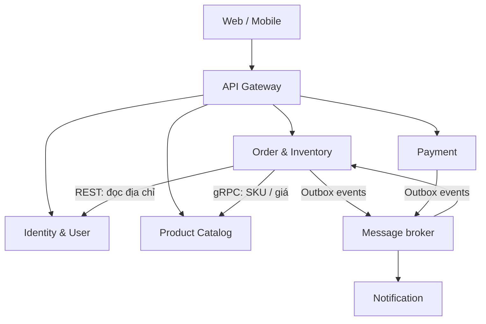

# Thiết kế DDD, database và API contract — Omnichannel E-Commerce (MVP)

Bản thống nhất cho Java + Spring Boot theo phạm vi **Identity, Product Catalog, Order & Inventory, Payment, Notification**. Gateway là hạ tầng; có **một ứng dụng và một database cho mỗi context**, trong đó Order và Inventory ở chung `order_db`. ERD để dán vào draw.io nằm trong `ERD_4_Service_Mermaid.md`.

## 0. Phạm vi và giả định

- `orders.channel` nhận `WEB` (website) hoặc `MOBILE` (app điện thoại). MVP **không đa kho**: không có `location_id`, bảng `locations` hay phân bổ nhiều kho.
- Dùng `VND`, `numeric(19,2)`/`BigDecimal` cho tiền, UUID cho ID và `timestamptz` UTC cho thời gian. MVP chưa làm khuyến mại, thuế, phí vận chuyển động, vận chuyển thực tế và hoàn tiền. `orders.total_amount` bằng tổng `order_items.subtotal`.
- `Product Catalog` dùng **PostgreSQL** với `jsonb` cho thuộc tính biến thể. Elasticsearch và MongoDB nằm ngoài MVP.
- `Order & Inventory` có một dòng `inventory` cho mỗi `sku_code`. `available_qty` là số lượng chưa giữ; `reserved_qty` là tổng số lượng đang giữ. Không có bảng Reservation: ghép `order_items` với các đơn `PENDING` để xác định đơn nào đang giữ từng SKU. Một đơn chỉ được nhả/xác nhận kho một lần.
- Chỉ có FK trong cùng database; `orders.user_id`, `payments.order_id` và `inventory.sku_code` là tham chiếu logic đến dữ liệu context khác. Các service trao đổi qua API/event, không đọc database của nhau.
- Payment method ở MVP: `VNPAY` hoặc `MOMO`. Webhook đã xác minh chữ ký là nguồn cập nhật thanh toán. Không lưu số thẻ, CVV hoặc bí mật trong `raw_response`.

## 1. Bounded Context và quyền sở hữu dữ liệu

| Context / service | Sở hữu | Giao tiếp chính |
| --- | --- | --- |
| Identity & User (`identity_db`) | `User`, `Role`, `Address`, refresh token | JWT, địa chỉ hiện hành để Order chụp snapshot |
| Product Catalog (`product_db`) | `Category`, `Brand`, `Product`, `ProductSku`, giá hiện tại | gRPC cho Order đọc SKU/giá; `ProductSkuCreated` ở giai đoạn event |
| **Order & Inventory (`order_db`)** | `Order`, `OrderItem` với snapshot địa chỉ/tên/giá **và** `Inventory`/`Stock` theo `sku_code` | Checkout, giữ/xác nhận/nhả hàng **nội bộ**, nhận event Payment |
| Payment (`payment_db`) | `Payment`, `PaymentTransaction`, outbox | Tạo phiên thanh toán, webhook, `PaymentSucceeded`/`PaymentFailed` |
| Notification (`notification_db`) | Nhật ký gửi thông báo | Nhận event và gửi email giả lập cho MVP |

**Order & Inventory triển khai chung một Spring Boot service và một PostgreSQL database.** Giữ hai nhóm package (`order` và `inventory`) trong service để tách mã nghiệp vụ; reserve/confirm/release là lời gọi nội bộ và dùng một transaction DB khi tạo/hủy/xác nhận đơn. Không có Inventory service riêng hay API reserve qua mạng. Gateway chỉ xác thực/định tuyến, không sở hữu nghiệp vụ.

`ProductSku` chứa thuộc tính và giá hiện tại; `OrderItem` giữ `sku_code`, `product_name`, `unit_price` và `subtotal` tại thời điểm đặt. `Inventory` chỉ giữ `sku_code` và số lượng. Không chia sẻ JPA entity giữa service.

**Giao tiếp Order → Product:** chọn **gRPC** cho lời gọi đồng bộ lấy SKU, tên, giá và trạng thái ngay trước khi tạo đơn. Hợp đồng Protobuf là ranh giới giữa hai service; Order sao chép dữ liệu trả về vào `order_items`, không truy cập `product_db`. Đặt deadline cho lời gọi; nếu Product không phản hồi thì không tạo đơn. `ProductSkuCreated` vẫn là event bất đồng bộ để khởi tạo dòng `inventory`, không thay thế bước xác nhận giá lúc checkout.

Nếu tích hợp gRPC bị vướng tiến độ, phương án lùi là OpenFeign/REST với cùng dữ liệu trả về và quy tắc snapshot; chỉ thay adapter gọi Product, không đổi quyền sở hữu dữ liệu hay luồng checkout.



## 2. Database schema theo service

Các bảng quan hệ dùng PostgreSQL, Flyway migrations và `NOT NULL` cho cột bắt buộc. Enum nghiệp vụ lưu `varchar` với giá trị cho phép xác nhận ở ứng dụng và CHECK ở migration. Index/UNIQUE ghi dưới đây là ràng buộc vật lý; Mermaid chỉ mô tả. `outbox_events` trong Order và Payment có `id`, `aggregate_type`, `aggregate_id`, `event_type`, `payload jsonb`, `status`, `retry_count`, `created_at`, `published_at`. Product sẽ thêm outbox lúc triển khai `ProductSkuCreated` đáng tin cậy ở Ngày 10.

### 2.1 `identity_db` — PostgreSQL

| Bảng | Cột cốt lõi | Ràng buộc |
| --- | --- | --- |
| `users` | `id`, `email`, `password_hash`, `full_name`, `phone`, `status`, `created_at`, `updated_at` | PK `id`, unique email chuẩn hóa |
| `roles` | `id`, `name` | unique `name`; giá trị `USER`, `ADMIN` |
| `user_roles` | `user_id`, `role_id` | PK kép, FK nội bộ |
| `addresses` | `id`, `user_id`, `recipient_name`, `phone`, `address_line`, `ward`, `district`, `city`, `is_default` | FK user; index `user_id`; tối đa một địa chỉ mặc định/user |
| `refresh_tokens` | `id`, `user_id`, `token_hash`, `expires_at`, `revoked`, `created_at`, `revoked_at`, `user_agent`, `device_info` | FK user; unique `token_hash`, index `user_id`; `revoked DEFAULT false`; không lưu token thô |

### 2.2 `product_db` — PostgreSQL

| Bảng | Cột cốt lõi | Ràng buộc |
| --- | --- | --- |
| `categories` | `id`, `name`, `slug`, `parent_id` | unique `slug`; FK `parent_id` nullable tự tham chiếu |
| `brands` | `id`, `name`, `slug` | unique `slug` |
| `products` | `id`, `name`, `slug`, `description`, `category_id`, `brand_id`, `base_price`, `status`, `created_at`, `updated_at` | unique `slug`; FK nội bộ; index `category_id`, `brand_id` |
| `product_skus` | `id`, `product_id`, `sku_code`, `attributes jsonb`, `price`, `image_url`, `updated_at` | unique `sku_code`; FK `product_id`; giá không âm |

`product_skus.sku_code` được công bố qua `ProductSkuCreated`. Consumer trong Order **chỉ INSERT nếu chưa có** `inventory(sku_code, available_qty=0, reserved_qty=0, version=0)`; event lặp không được reset tồn kho. Cần backfill SKU cũ khi bật tích hợp lần đầu. Tìm kiếm full-text/Elasticsearch là phần mở rộng nếu còn thời gian.

### 2.3 `order_db` — PostgreSQL (Order & Inventory chung một DB)

| Bảng | Cột cốt lõi | Ràng buộc |
| --- | --- | --- |
| `inventory` | `id`, `sku_code`, `available_qty`, `reserved_qty`, `version` | unique `sku_code`; CHECK hai số lượng không âm; `version` cho optimistic locking |
| `orders` | `id`, `user_id`, `channel`, `status`, `payment_status`, `total_amount`, `shipping_recipient_name`, `shipping_phone`, `shipping_address`, `created_at`, `updated_at` | index `(user_id, created_at DESC)` và `(status, created_at)`; snapshot địa chỉ; **không** FK user sang Identity |
| `order_items` | `id`, `order_id`, `sku_code`, `product_name`, `unit_price`, `quantity`, `subtotal` | FK `order_id`, index `order_id`; `quantity>0`, `unit_price>=0`; `subtotal=unit_price×quantity` |
| `outbox_events` | các cột theo quy ước trên | index `(status, created_at)` cho worker |

`orders.status`: `PENDING`, `CONFIRMED`, `SHIPPING`, `COMPLETED`, `CANCELLED`. `orders.payment_status`: `UNPAID`, `PAID`, `FAILED`. `orders.channel`: `WEB`, `MOBILE`; đây là kênh client khai khi tạo đơn, không phải vị trí kho. Migration đặt CHECK giới hạn hai giá trị này. Không có `location_id`, `reservation_id`, `stock_movements` hay bảng `reservations`. `orders.total_amount` bằng tổng item subtotal trong MVP.

Index `(status, created_at)` phục vụ job timeout tìm đơn `PENDING` quá hạn; `(user_id, created_at DESC)` phục vụ danh sách đơn của user theo thời gian mới nhất và thay cho index đơn cột `user_id`.

**Ý nghĩa giữ hàng:** khi tạo đơn `PENDING`, cùng transaction ghi `orders` + `order_items`, trừ `inventory.available_qty` và cộng `inventory.reserved_qty`. Khi thanh toán thành công, chuyển `PENDING → CONFIRMED`, `UNPAID → PAID` và trừ `reserved_qty`; lượng `available_qty` giữ nguyên vì đã trừ khi reserve. Khi thanh toán thất bại/hết hạn hoặc hủy đơn trước thanh toán, chuyển `PENDING → CANCELLED`, đặt `payment_status=FAILED` nếu thanh toán thất bại; cộng lại `available_qty` và trừ `reserved_qty`. Hủy chủ động trước khi thanh toán giữ `UNPAID` nếu chưa có kết quả thanh toán. Việc giữ của từng đơn được suy từ `order_items` chỉ khi đơn còn `PENDING`.

Trong transaction, gộp item trùng SKU, xử lý SKU theo thứ tự cố định và dùng cập nhật có điều kiện, ví dụ `UPDATE inventory SET available_qty=available_qty-:q, reserved_qty=reserved_qty+:q, version=version+1 WHERE sku_code=:sku AND available_qty>=:q`. Đòi `rowCount=1` cho từng SKU; lỗi thì rollback cả đơn. Các nhánh confirm/release khóa hoặc cập nhật điều kiện `orders.status='PENDING'` trong **cùng transaction** với cập nhật kho, để event lặp và timeout không trừ/nhả hai lần. `version` dùng cho các đường cập nhật optimistic.

**Hai lớp kiểm soát tồn kho:**

- **Đúng đắn:** conditional update, kiểm tra `rowCount`, CHECK/`NOT NULL` và transaction PostgreSQL là chốt chặn cuối chống bán vượt kho. Redis lock hết hạn hoặc mất kết nối cũng không được làm bỏ qua bước này.
- **Giảm tranh chấp khi flash sale:** Order dùng Redisson distributed lock theo `sku_code` **trước khi mở transaction** reserve. Nếu đơn có nhiều SKU, lấy lock theo thứ tự cố định; dùng thời gian chờ/lease hữu hạn, trả lỗi hoặc yêu cầu thử lại khi không lấy được lock. Giữ lock đến khi transaction commit/rollback rồi giải phóng trong `finally`. Lớp này giảm số request cùng tranh một dòng `inventory` và số lần retry do contention; không thay thế ràng buộc PostgreSQL.

### 2.4 `payment_db` — PostgreSQL

| Bảng | Cột cốt lõi | Ràng buộc |
| --- | --- | --- |
| `payments` | `id`, `order_id`, `amount`, `method`, `status`, `created_at`, `updated_at` | unique `order_id`: một payment/đơn; `status=PENDING/SUCCESS/FAILED` |
| `payment_transactions` | `id`, `payment_id`, `gateway_txn_id`, `raw_response jsonb`, `status`, `created_at` | FK `payment_id`; unique `gateway_txn_id` khi có; `status=PENDING/SUCCESS/FAILED` cho từng lần thử |
| `outbox_events` | các cột theo quy ước trên | index `(status, created_at)` cho worker |

Không có bảng `payment_attempts`, `webhook_inbox`, `refunds`; các lần thử và phản hồi đã xác minh lưu ở `payment_transactions`. Webhook: kiểm chữ ký, dùng `gateway_txn_id UNIQUE`, khóa/điều kiện trạng thái `payments.status=PENDING`, ghi transaction + cập nhật payment + outbox trong cùng transaction. Webhook lặp phải trả thành công phù hợp provider nhưng không phát event lần hai; nếu INSERT gặp xung đột unique, đọc giao dịch đã lưu và kiểm tra kết quả trước khi trả lời. Nếu gateway ID chỉ duy nhất **trong từng provider**, cần unique `(method, gateway_txn_id)` sau khi đưa `method` vào bảng transaction; phạm vi MVP giả định ID duy nhất toàn hệ thống. Hoàn tiền để giai đoạn sau.

### 2.5 `notification_db` — PostgreSQL đơn giản

| Bảng | Cột cốt lõi | Ràng buộc |
| --- | --- | --- |
| `notification_logs` | `id`, `source_event_id`, `recipient`, `status`, `attempt_count`, `created_at`, `sent_at` | unique `(source_event_id, recipient)` tránh gửi lặp; `status=PENDING/SENT/FAILED` |

Consumer nhận `OrderConfirmed`/`OrderCancelled`, gửi email giả lập và lưu log; lỗi Notification không làm rollback Order. Không cần template management, SMS/Push hoặc database Redis cho MVP.

## 3. API contract v1 (theo phạm vi MVP)

Base path `/api/v1`; JWT cho người dùng, `ADMIN` cho quản trị. JSON `camelCase`, UUID dạng string, tiền dùng `BigDecimal` ở Java. Endpoint nội bộ chỉ mở trong mạng service với service credentials; Gateway không chuyển tiếp chúng ra công khai.

| Context | Method + path | Quyền | Request chính | Kết quả / lỗi tiêu biểu |
| --- | --- | --- | --- | --- |
| Identity | `POST /auth/register` | public | `email,password,fullName` | `201 UserView`; `409 EMAIL_EXISTS` |
| Identity | `POST /auth/login` | public | `email,password` | `200` access/refresh token; `401` |
| Identity | `POST /auth/refresh` | public | `refreshToken` | `200` token mới; `401` |
| Identity | `GET /users/me` | user | — | `200 UserView` gồm hồ sơ người dùng hiện tại |
| Identity | `GET /users/me/addresses` | user | — | `200 AddressView[]` |
| Identity | `POST /users/me/addresses` | user | `recipientName,phone,addressLine,ward,district,city,isDefault` | `201 AddressView` |
| Product Catalog | `GET /products?categoryId=&page=0&size=20` | public | query params | `200 Page<ProductSummary>` |
| Product Catalog | `GET /products/{id}` | public | — | `200 ProductDetail` gồm SKUs |
| Product Catalog | `POST /admin/products` | admin | product + SKU DTO | `201 ProductDetail`; `409 SKU_EXISTS` |
| Product Catalog | `POST /admin/products/{id}/skus` | admin | `skuCode,attributes,price,imageUrl` | `201 SkuView`; Ngày 10 phát `ProductSkuCreated` |
| Order & Inventory | `POST /orders` | user | `channel=WEB/MOBILE,addressId,items:[{skuCode,quantity}]` | `201 OrderView`; `400 INVALID_CHANNEL`, `409 OUT_OF_STOCK`, `422 SKU_UNAVAILABLE` |
| Order & Inventory | `GET /orders/{id}` | owner/admin | — | `200 OrderView`; `404` nếu không thuộc user |
| Order & Inventory | `GET /orders?page=0&size=20` | user | — | `200 Page<OrderSummary>` sắp theo `created_at DESC` |
| Order & Inventory | `POST /orders/{id}/cancel` | owner/admin | `reason` | `200 OrderView`; `409 ORDER_NOT_CANCELLABLE` |
| Order & Inventory | `PATCH /admin/orders/{id}/status` | admin | `status=SHIPPING/COMPLETED` | `200`; chỉ với đơn đủ điều kiện |
| Order & Inventory | `GET /admin/inventory/{skuCode}` | admin | — | `200 {skuCode,availableQty,reservedQty,version}` |
| Order & Inventory | `POST /admin/inventory/{skuCode}/adjustments` | admin | `delta,reason` | `200 StockView`; không cho số lượng âm |
| Payment | `POST /orders/{orderId}/payments` | owner | `method` | `201 PaymentView` gồm checkout URL; unique order/payment |
| Payment | `GET /orders/{orderId}/payments` | owner/admin | — | `200 PaymentView` |
| Payment | `POST /webhooks/payments/{method}` | provider | raw body + chữ ký | `2xx` sau khi xác minh/lưu; lỗi chữ ký `400/401` |

Khi `POST /orders`, Order service lấy `userId` từ JWT, đọc địa chỉ thuộc user từ Identity và SKU/giá/tên từ Product Catalog rồi **copy** sang đơn. Không tin giá, tổng tiền hoặc địa chỉ text do client tự gửi. **Client gửi `channel` trong request body**; Order service chỉ chấp nhận `WEB` hoặc `MOBILE` và trả `400 INVALID_CHANNEL` cho giá trị khác. Server không xác minh được client thực sự là website hay app: client có thể khai sai kênh; đây là giới hạn của MVP. Nếu SKU chưa được đồng bộ sang `inventory`, trả lỗi/ghi nhận để đồng bộ; không tự tạo dòng inventory với tồn tùy ý. API Order không có `locationId` hoặc `/internal/reservations`.

**Mẫu request:**

```http
POST /api/v1/orders
Authorization: Bearer <jwt>
Content-Type: application/json

{"channel":"WEB","addressId":"14dfe003-7e3e-4f64-bab9-097808f37134","items":[{"skuCode":"AO-A-DO-M","quantity":2}]}
```

**Mẫu `201`:**

```json
{
  "code": "ORDER_CREATED",
  "message": "Đơn hàng đã được tạo và đang chờ thanh toán",
  "data": {
    "id": "8787208d-e63f-4218-aaf7-090328a7eea3",
    "status": "PENDING",
    "paymentStatus": "UNPAID",
    "channel": "WEB",
    "shippingRecipientName": "Nguyễn An",
    "shippingPhone": "0900000000",
    "shippingAddress": "12 Đường A, Phường B, Hà Nội",
    "items": [{"skuCode":"AO-A-DO-M","productName":"Áo thun mẫu A","quantity":2,"unitPrice":120000.00,"subtotal":240000.00}],
    "totalAmount": 240000.00
  },
  "traceId": "ad36dcffb4bb4ecf8b785393923c2a0f",
  "timestamp": "2026-09-29T15:00:00Z"
}
```

## 4. Quy ước JSON response

Success: `{ "code": "SUCCESS", "message": "...", "data": <object|array|page>, "traceId": "...", "timestamp": "ISO-8601 UTC" }`. `201` cho tạo mới, `202` nếu xử lý nền, `204` không có body; phân trang `data: {"items":[],"page":0,"size":20,"totalElements":0,"totalPages":0}`. Không trả `200` khi có lỗi.

Error: dùng mã HTTP thực (`400`, `401`, `403`, `404`, `409`, `422`, `429`, `500`, `503`):

```json
{
  "code": "OUT_OF_STOCK",
  "message": "Không đủ hàng",
  "data": null,
  "errors": [{"field":"items[0].quantity","message":"Số lượng khả dụng không đủ"}],
  "traceId": "ad36dcffb4bb4ecf8b785393923c2a0f",
  "timestamp": "2026-09-29T15:00:01Z"
}
```

`code` ổn định cho frontend, `errors` chỉ khi cần chi tiết từng trường. Không lộ stack trace, SQL, token hay dữ liệu nhạy cảm. Webhook đáp ứng giao thức của provider, không bắt buộc dùng envelope JSON. Spring Boot có thể dùng `ApiResponse<T>`, `@RestControllerAdvice`, `ResponseEntity`, Bean Validation và `BigDecimal`.

## 5. Checkout, giữ hàng và event (không có Inventory service riêng)

1. Order service gọi gRPC đến Product Catalog lấy SKU/giá/trạng thái và đọc địa chỉ từ Identity. Chụp `product_name`, `unit_price` trong `order_items` và `shipping_*` trong `orders`; tính `subtotal` và `total_amount` ở server.
2. Lấy Redisson lock theo từng `sku_code` trước khi mở transaction. Trong **một transaction `order_db`**, tạo `orders(PENDING, UNPAID)` và items; reserve từng SKU bằng cập nhật có điều kiện `available_qty -= q`, `reserved_qty += q`; ghi `OrderCreated` vào `outbox_events`. Nếu bất kỳ SKU nào thiếu hàng, rollback toàn bộ transaction và trả `409`; nhả lock sau commit/rollback.
3. Client gọi Payment tạo checkout. Payment có duy nhất một `payments` row/order; các lần thử nằm trong `payment_transactions`. Payment xác minh webhook và ghi transaction, `payments.status`, `outbox_events` cùng một transaction; `gateway_txn_id UNIQUE` và chuyển trạng thái có điều kiện chống webhook lặp.
4. Order tiêu thụ `PaymentSucceeded`/`PaymentFailed`. Nếu đơn còn `PENDING`, trong một transaction cập nhật trạng thái Order và số lượng theo `order_items`: thành công trừ `reserved_qty`, chuyển `PAID/CONFIRMED`; thất bại cộng lại `available_qty`, trừ `reserved_qty`, chuyển `FAILED/CANCELLED`. Đơn đã xử lý không được tác động tồn kho lần hai.
5. Job timeout xử lý các đơn `PENDING` quá hạn theo cùng nhánh release; khi chưa có cột `expires_at`, dùng `created_at + thời hạn giữ hàng` cấu hình. Notification nhận `OrderConfirmed`/`OrderCancelled`, ghi log và gửi email giả lập độc lập.

**Race và giới hạn MVP:** timeout/hủy có thể thắng trước webhook thành công. Khi tiền đã thu mà đơn đã `CANCELLED` và hàng đã nhả, **không tự xác nhận đơn**. Ghi log/cảnh báo cho admin đối soát và xử lý hoàn tiền thủ công ngoài phạm vi MVP. Không được âm thầm đánh dấu `PAID` rồi bỏ qua hàng. Cần thiết kế hoàn tiền tự động ở giai đoạn sau. Vì thiếu bảng idempotency key của Order, retry `POST /orders` từ client có thể tạo đơn khác; nâng cấp thêm `Idempotency-Key` + unique storage trước khi mở bán thực tế.

**Outbox:** transaction nghiệp vụ ghi event vào bảng; worker đọc `PENDING`, publish, tăng `retry_count` khi lỗi và đặt `SENT/published_at` sau xác nhận broker. Consumer có thể nhận trùng nên phải dùng chuyển trạng thái có điều kiện; Notification dùng unique `(source_event_id,recipient)`. Product sẽ thêm outbox khi thực hiện `ProductSkuCreated` ở Ngày 10. Event không chứa dữ liệu cá nhân không cần thiết.

Event tối thiểu gồm `eventId`, `eventType`, `eventVersion`, `aggregateId`, `occurredAt`, `traceId`, `payload`. Event MVP: `ProductSkuCreated`, `OrderCreated`, `OrderConfirmed`, `OrderCancelled`, `PaymentSucceeded`, `PaymentFailed`. `OrderCreated` không có nghĩa đã thanh toán.

## 6. Trình tự triển khai Java + Spring Boot

1. Năm ứng dụng nghiệp vụ: `identity-service`, `product-service`, `order-service` (**gồm** package `order` và `inventory`), `payment-service`, `notification-service`; Gateway riêng. Mỗi ứng dụng sở hữu một database PostgreSQL.
2. Migration Flyway đúng theo ERD, index và unique; `CHECK (available_qty>=0 AND reserved_qty>=0)`, `CHECK (quantity>0)`, `CHECK (unit_price>=0)` cùng `NOT NULL`. `payments.order_id UNIQUE`, `payment_transactions.gateway_txn_id UNIQUE` khi có.
3. Test đồng thời 100 yêu cầu mua cùng SKU khi `available_qty=1`: tối đa một transaction thành công; không âm tồn; event/webhook lặp không trừ hoặc nhả kho hai lần. So sánh chạy có/không có Redisson lock về số request tranh chấp, retry và độ trễ; tính đúng đắn phải đạt ở cả hai cấu hình.
4. Demo đặt đơn → thanh toán sandbox/giả lập → webhook → confirm → notification; thêm case payment thất bại, timeout, webhook lặp và tắt Notification.

> Chốt trước khi code: thời hạn giữ hàng, giá thay đổi giữa lúc xem và checkout, cách tạo checkout URL từng gateway, và quy trình đối soát thủ công cho thanh toán đến sau hủy đơn. Không có hoàn tiền tự động trong MVP.
