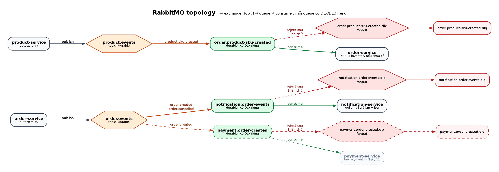

# RabbitMQ topology và Outbox

Thiết kế giao tiếp bất đồng bộ giữa các service. Bối cảnh tổng thể: [architecture.png](architecture.png); luồng nghiệp vụ: [DDD_DB_API_Contract.md](DDD_DB_API_Contract.md) mục 5.

*(Nguồn sơ đồ: [rabbitmq-topology.dot](rabbitmq-topology.dot). Khung nét đứt = chưa triển khai.)*

## 1. Bảng topology

| Exchange (topic) | Routing key | Queue | Consumer | Trạng thái |
| --- | --- | --- | --- | --- |
| `order.events` | `order.created`, `order.cancelled` | `notification.order-events` | notification-service | ✅ |
| `order.events` | `order.created` | `payment.order-created` | payment-service | Ngày 11 |
| `product.events` | `product.sku.created` | `order.product-sku-created` | order-service | Kế hoạch |

**Quy ước đặt tên**

- Exchange: `<bounded-context>.events`, kiểu `topic`, `durable`.
- Routing key: `<aggregate>.<sự kiện ở thì quá khứ>`, ví dụ `order.created`.
- Queue: `<service nhận>.<nội dung>`, `durable`. Mỗi service có queue riêng; hai service cùng nghe một event thì mỗi bên nhận một bản.
- Dead letter: `<queue>.dlx` (exchange) → `<queue>.dlq` (queue).

**Exchange và routing key là hợp đồng công khai** giữa các service; **queue là chi tiết riêng** của bên nhận.

## 2. Ai khai báo cái gì

| Service | Khai báo | Ghi chú |
| --- | --- | --- |
| order-service | exchange `order.events` | bên phát |
| notification-service | exchange `order.events`, queue + 2 binding, DLX + DLQ | khai báo lặp exchange để binding không lỗi khi khởi động trước bên phát |
| payment-service (Ngày 11) | exchange `order.events`, queue `payment.order-created` + binding, DLX + DLQ | |
| product-service (kế hoạch) | exchange `product.events` | cần thêm `spring-boot-starter-amqp` + biến môi trường Rabbit trong compose |

Khai báo trùng một exchange ở cả hai bên là an toàn, vì RabbitMQ chấp nhận khai báo lặp nếu tham số giống nhau (`topic`, `durable=true`, `auto_delete=false`).

**Tham số queue không sửa được sau khi tạo.** Muốn thêm `x-dead-letter-exchange` cho một queue đã tồn tại thì lần khai báo sau sẽ lỗi `PRECONDITION_FAILED` và service không khởi động được. Cách duy nhất là xóa queue (mất message đang chờ) rồi khai báo lại. Vì vậy mọi queue đều có DLX ngay từ đầu.

**Chưa khai báo `payment.order-created`.** Theo nguyên tắc "bên nhận khai báo queue", queue này do payment-service tạo khi có consumer ở Ngày 11. Nếu tạo sớm, mọi `order.created` từ bây giờ sẽ dồn trong queue, và payment-service sẽ xử lý cả các đơn test cũ khi bật lên. Muốn tạo sớm để không lỡ event thì phải purge queue trước khi bật consumer.

## 3. Dead letter

- Mỗi queue có `x-dead-letter-exchange = <queue>.dlx`. DLX là exchange `fanout`, bind tới `<queue>.dlq`.
- **Vì sao fanout:** message bị dead-letter **giữ nguyên routing key gốc** (`order.created`). Nếu dùng DLX `direct` mà bind DLQ bằng key khác, message sẽ bị drop im lặng. DLX đã riêng cho từng queue nên fanout là đủ và không phụ thuộc routing key.
- DLQ không có consumer. Xem message bằng Management UI (http://localhost:15672 → Queues → `*.dlq` → *Get messages*); header `x-death` cho biết lý do (`rejected`) và số lần. Cách chuyển message về queue gốc xem [deployment-notes.md](deployment-notes.md).

## 4. Định dạng message

| Thuộc tính AMQP | Giá trị |
| --- | --- |
| body | `outbox_events.payload` nguyên dạng byte UTF-8 (JSON) |
| `content_type` | `application/json` |
| `message_id` | `outbox_events.id`. Consumer dùng giá trị này để chống xử lý trùng |
| `delivery_mode` | `2` (persistent) |
| `timestamp` | `outbox_events.created_at` |
| header `eventType` | `ORDER_CREATED` / `ORDER_CANCELLED` |
| header `aggregateId` | id của đơn hàng |

Payload `order.created`: `orderId`, `userId`, `channel`, `totalAmount`, `skus` (map `skuCode → quantity`). Payload `order.cancelled`: `orderId`, `userId`. Thứ tự key có thể khác lúc ghi, vì PostgreSQL chuẩn hóa `jsonb`.

**Không dùng JSON converter ở bên phát.** Payload đã là JSON trong outbox; gửi byte giúp tránh hẳn vấn đề chuyển đổi Jackson 2/3 của các converter Spring AMQP trên Spring Boot 4. Bên nhận tự parse bằng `JsonMapper` của Jackson 3 (`tools.jackson.databind`).

## 5. Outbox relay (order-service)

`OutboxRelay` chạy `@Scheduled(fixedDelay = 1000)`. Mỗi lượt đọc tối đa 50 event `PENDING` theo `created_at`; với **từng event**: publish → chờ publisher confirm (tối đa 5 giây) → cập nhật trạng thái trong một transaction ngắn riêng. Không giữ transaction DB trong lúc chờ mạng.

| Kết quả publish | Xử lý |
| --- | --- |
| Broker ACK, không bị return | `markSent` → `SENT`, `published_at` |
| Broker NACK | `retry_count + 1` |
| Bị return (`mandatory`, không queue nào nhận routing key) | `retry_count + 1`. ACK của broker **không đủ**: message không vào queue nào vẫn được ACK |
| Hết 5 giây không có confirm | `retry_count + 1`, dừng batch (broker có thể đang treo) |
| Không mở được kết nối (broker chết) | **Giữ `PENDING`, không tăng retry**, dừng batch, lượt sau thử lại |
| `event_type` không có routing key | `retry_count + 1` → cuối cùng `FAILED` |

`retry_count` đạt 10 → `FAILED`, phải can thiệp tay (xem [deployment-notes.md](deployment-notes.md)).

**Vì sao broker chết không tính là retry:** relay chạy mỗi giây. Nếu tính, broker chết 10 giây sẽ đẩy toàn bộ event sang `FAILED` và phải sửa tay, trái với mục đích của outbox là để order-service tiếp tục nhận đơn khi broker chết.

Cấu hình bắt buộc (`order-service/application.yml`): `publisher-confirm-type: correlated`, `publisher-returns: true`, `template.mandatory: true`. Không có confirm thì `send()` thành công chỉ nghĩa là byte đã rời socket; broker sập ngay sau đó là mất event trong khi DB ghi `SENT`.

`management.health.rabbit.enabled: false` trong order-service: broker chết không được làm order-service bị Docker đánh dấu unhealthy, vì lúc đó nó đang hoạt động đúng thiết kế.

## 6. Consumer (notification-service)

- `@RabbitListener` trên `notification.order-events`, nhận `Message` thô.
- **Idempotent:** trong một transaction, `INSERT INTO processed_messages ... ON CONFLICT (message_id) DO NOTHING`. Được 0 dòng nghĩa là message trùng: log, ack, bỏ qua. Được 1 dòng thì ghi `notifications` và log `[EMAIL GIẢ LẬP]`. Hai bảng nằm trong cùng một transaction nên không thể có trạng thái "đã đánh dấu mà chưa gửi" hay "đã gửi mà chưa đánh dấu".
  - Không bắt unique violation: trên PostgreSQL, lỗi bất kỳ làm transaction chuyển sang *aborted*, và Spring đánh dấu rollback-only. Bắt exception rồi `return` vẫn nổ `UnexpectedRollbackException` lúc commit, khiến message trùng bị retry rồi vào DLQ.
  - Với email thật (không phải log), việc gửi vẫn có thể lặp nếu commit lỗi sau khi đã gửi; khi đó cần thêm outbox phía Notification.
- **Retry:** `retry.enabled: true`, `max-retries: 2` (tổng 3 lần), backoff 1s → 2s (tối đa 5s), `default-requeue-rejected: false`. Hết retry thì reject không requeue và message vào DLQ.
  - Spring Boot 4 dùng `max-retries` (số lần thử *lại*); key `max-attempts` cũ không còn và bị **bỏ qua im lặng**.
- **Message hỏng** (thiếu `message_id`, JSON sai, thiếu `orderId`/`userId`, routing key lạ): ném `AmqpRejectAndDontRequeueException` để vào DLQ ngay.
  - Retry interceptor của Spring AMQP 4 retry *mọi* exception, kể cả loại này. `RabbitListenerRetrySettingsCustomizer` loại trừ nó khỏi retry policy; policy khớp theo cả chuỗi cause nên lớp `ListenerExecutionFailedException` bọc ngoài vẫn khớp.

**Đã kiểm chứng trên stack Docker Compose (09/10/2026):**

| Kịch bản | Kết quả |
| --- | --- |
| 49 event PENDING tồn đọng khi relay khởi động | 49 `SENT`, 49 notification, `retry_count = 0` |
| Gửi lại message có `message_id` đã xử lý | log "Duplicate message, skip", không thêm notification, không vào DLQ |
| Payload `{not json` | vào DLQ trong < 0,7 giây, không backoff, nghĩa là không retry |
| Bảng `notifications` tạm không tồn tại | 1,5 giây vẫn chưa vào DLQ (đang backoff), 5,5 giây đã vào DLQ; `processed_messages` không có dòng (rollback) |
| Dừng RabbitMQ rồi tạo + hủy đơn | đơn tạo/hủy bình thường, health `UP`, 2 event `PENDING` với `retry_count = 0`; bật lại broker thì cả hai `SENT` và được tiêu thụ |

## 7. Hạn chế đã biết

- **Chạy từ 2 instance order-service trở lên thì có thể gửi trùng.** Các relay có thể đọc cùng một event `PENDING` và cùng publish. Cách sửa là đọc batch bằng native query `SELECT ... FOR UPDATE SKIP LOCKED` trong transaction ngắn để mỗi instance nhận các dòng khác nhau. Hiện chạy 1 instance nên chưa làm.
- **Outbox chỉ bảo đảm at-least-once**, kể cả khi chạy 1 instance: relay có thể sập sau khi broker ACK nhưng trước khi `markSent` commit, và lượt sau sẽ gửi lại. Mọi consumer vì vậy **bắt buộc idempotent** theo `message_id`.
- **Thứ tự không được bảo đảm tuyệt đối.** Event bị retry sẽ đi sau các event mới hơn trong cùng batch; consumer không được giả định `order.cancelled` luôn đến sau `order.created`.
- Retry của consumer là in-memory (stateless): luồng consumer bị chặn trong thời gian backoff (tối đa ~3 giây cho mỗi message lỗi). Chấp nhận được ở MVP.
